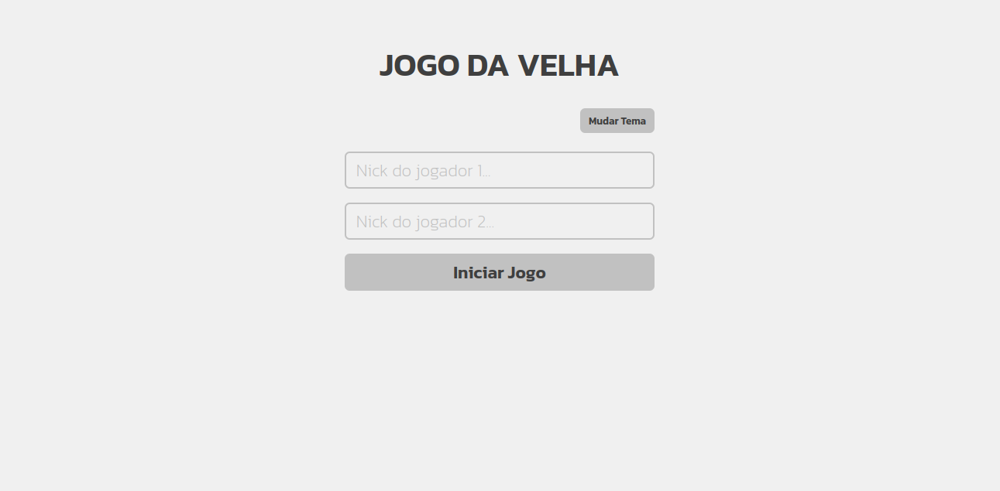
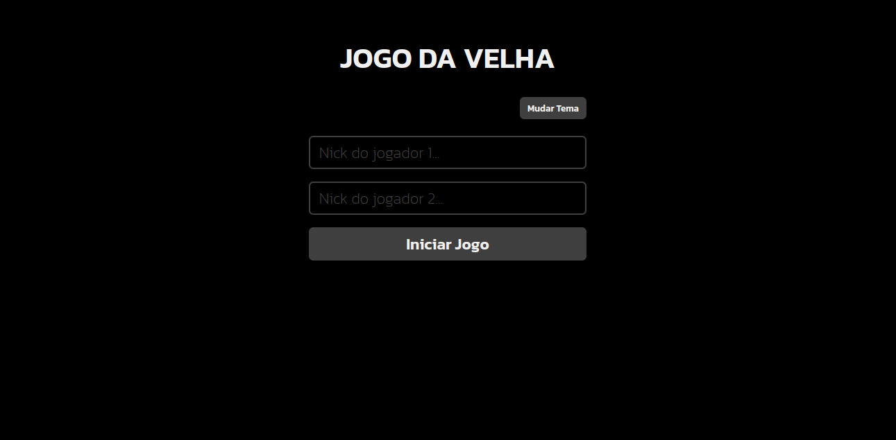
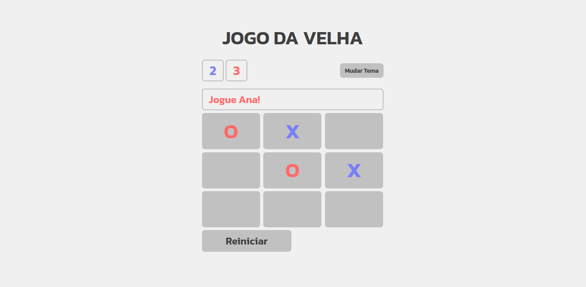
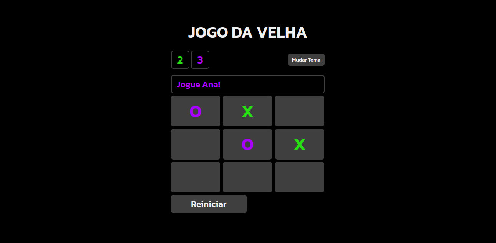
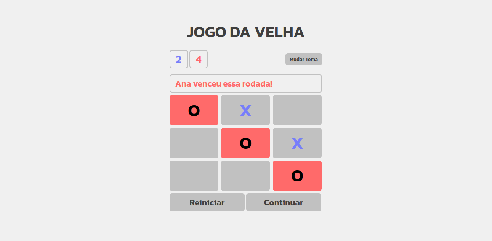
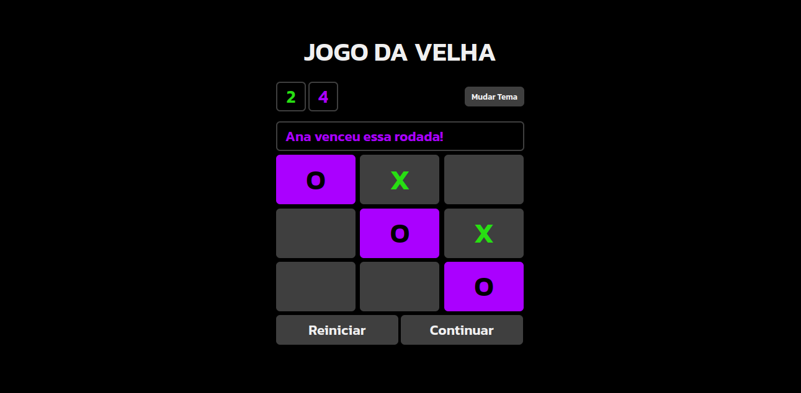

# Jogo da Velha

O principal objetivo desse projeto é praticar alguns conceitos de Javascript, CSS e HTML. Além disso, praticar comandos do Git.

## Quais os requisitos desse projeto?
1. Deve ser capaz de receber o nome de dois jogadores
2. Mostrar o nome do jogador da vez
3. Quando clicar no espaço marcar com "X" ou "O", dependendo do jogador
4. Não deve ser possível marcar um espaço que já foi marcado antes
5. Mostar o nome do vencedor na tela e marcar a sequência que o jogador marcou para vencer
6. Mostrar em caso de empate também
7. Deve ser possível continuar jogando com os mesmos jogadores, alternando quem joga primeiro
8. Deve ser possível encerrar o jogo e voltar para a tela inicial para que outros jogadores joguem
9. Mudar de tema Dark/Light

## O que devo praticar nesse projeto?
### Javascript:
1. Manipulação de DOM
2. Manipulação de Atributo Data

### CSS:
1. Uso de variáveis globais
2. Uso de flex/grid

### HTML:
1. Uso do Atributo Data

## Layout finalizado

